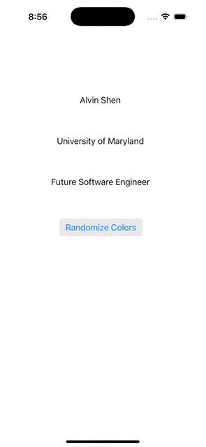

# Prework - _CodePathPrework_

Submitted by: **Alvin Shen**

**CodePathPrework** is an app that... [TODO]

Time spent: **3** hours spent in total

## Required Features

The following **required** functionality is completed:

- [x] Users are see a screen with three labels and a button
- [x] Tapping the button changes the screen color to a random color

## Video Walkthrough

## App Brainstorming (Step 4)

- Apollo
  - infinite scroll
  - swipe gestures
  - simple graphical interface
- Discord
  - real-time chatting
  - notifications
- YouTube
  - comments
  - subscriptions
  - views and likes
- Slack
  - real-time chatting
  - video calls
  - channels

An app idea I have is a todo list app with a points system. Users can add
items to the list, and each item can have sub-items. Completing items will
earn the user points. Users can add soft and hard deadlines for tasks.
Completing tasks early will score more points, and tasks completed after
the deadline will be penalized. A streak system will keep track of the
number of tasks that the user has fulfilled without missing deadlines. A
graph can show the score overtime similar to credit scores. The app will
help users plan our their time and set reasonable deadlines.

## Notes

Describe any challenges encountered while building the app.

An error occurred when trying to download the simulators within Xcode.
A solution I found on the internet was to manually download the simulators
from Apple's website and import with a command. Fortunately, the solution
worked, and I was able to build and test the app.

## License

    Copyright 2024 Alvin Shen

    Licensed under the Apache License, Version 2.0 (the "License");
    you may not use this file except in compliance with the License.
    You may obtain a copy of the License at

        http://www.apache.org/licenses/LICENSE-2.0

    Unless required by applicable law or agreed to in writing, software
    distributed under the License is distributed on an "AS IS" BASIS,
    WITHOUT WARRANTIES OR CONDITIONS OF ANY KIND, either express or implied.
    See the License for the specific language governing permissions and
    limitations under the License.
